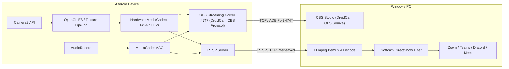

<h1 align="center">
  <sub>
    
  </sub>
  <br>
  VCamdroid
</h1>

<p align="center">Turn your Android phone into a high-performance Windows webcam and professional OBS Studio camera.</p>

<p align="center">
  <a href="https://github.com/ShadowPlague21/VCamdroid/blob/main/LICENSE">
    
  </a>
  <a href="https://github.com/ShadowPlague21/VCamdroid/releases">
    
  </a>
  <a href="https://github.com/ShadowPlague21/VCamdroid/releases">
    
  </a>
</p>

## Table of Contents

1. [**Description**](#description)
2. [**Key Features**](#key-features)
3. [**Modes of Operation**](#modes-of-operation)
   * [1. OBS Studio Mode (DroidCam OBS Drop-in Replacement)](#1-obs-studio-mode-droidcam-obs-drop-in-replacement)
   * [2. Desktop Client & Virtual Webcam Mode](#2-desktop-client--virtual-webcam-mode)
4. [**Pro Studio Controls**](#pro-studio-controls)
5. [**Installation Guide**](#installation-guide)
6. [**Usage Instructions**](#usage-instructions)
   * [OBS Studio via Wired USB (ADB)](#obs-studio-via-wired-usb-adb)
   * [OBS Studio via Local Wi-Fi](#obs-studio-via-local-wi-fi)
   * [Windows Desktop Client via USB / Wi-Fi](#windows-desktop-client-via-usb--wi-fi)
7. [**Screen-Off & Background Streaming**](#screen-off--background-streaming)
8. [**Technical Architecture**](#technical-architecture)
9. [**Troubleshooting**](#troubleshooting)
10. [**Contributing**](#contributing)

---

## Description

**VCamdroid** transforms your Android smartphone into a broadcast-grade video capture device. It provides two powerful operating modes:
1. **Direct OBS Studio Streaming (DroidCam OBS Drop-in Replacement):** A standalone, low-latency streaming server running directly on your phone. It acts as a seamless **drop-in replacement for the DroidCam OBS plugin** in OBS Studio over Wi-Fi and high-speed USB (ADB), featuring pro studio manual camera controls, live tally feedback, direct numeric entry, and hardware-accelerated H.264/HEVC encoding up to 1080p @ 60 FPS.
2. **Windows Virtual Webcam:** A custom DirectShow filter registered via the desktop client, enabling seamless camera feeds into Zoom, Microsoft Teams, Discord, Google Meet, and any standard Windows webcam application.

<p align="center">
  
</p>

---

## Key Features

* **Pro Manual Studio Controls:**
  * **Manual ISO Sensitivity:** Full control from ISO 100 up to 6400 with automatic exposure compensation synchronization and instant Auto/Manual toggle.
  * **Continuous Smooth Sliders:** 10,000 sub-step smooth, non-snapping sliders for zoom (1.0x to 10.0x), EV compensation, and manual focus distance.
  * **Direct Tap-to-Edit Inputs:** Tap any value indicator (ISO, Zoom, EV, Focus) to open an exact numeric entry dialog.
  * **White Balance Presets:** Instant selection between Auto, Daylight, Cloudy, Fluorescent, and Incandescent color temperatures.
  * **Manual Focus Puller:** Switch between continuous auto-focus and precise manual lens positioning.
  * **Integrated Torch / Flashlight:** One-tap toggle for device LED illumination.
  * **Lens Switching:** Seamlessly switch between rear and front-facing camera sensors.

* **OBS Studio & DroidCam OBS Integration:**
  * **DroidCam OBS Drop-in Replacement:** Fully compatible with the popular DroidCam OBS plugin inside OBS Studio. Connects directly as a DroidCam OBS source on port `4747` without needing any client software modifications.
  * **Hardware Acceleration:** Hardware-accelerated H.264 (AVC) and H.265 (HEVC) encoding up to 1080p at 60 frames per second.
  * **Live Tally Indicator:** Real-time visual status badges (**PROGRAM** active broadcast, **PREVIEW** staging, **STANDBY** idle) driven by OBS feedback.
  * **Synchronized Audio Streaming:** High-fidelity 44.1 kHz AAC audio capture directly from device microphones.

* **Battery & Screen Preservation:**
  * **AMOLED True-Black Screen Saver:** Turn on a 0% power black overlay during live broadcasts to protect OLED/AMOLED screens against burn-in.
  * **Physical Power-Button Background Streaming:** Keep streaming continuously with the physical power button pressed and the screen completely locked/turned off, powered by an Android foreground service with partial wake locks and low-latency Wi-Fi locks.

* **Dual-Mode Connectivity:**
  * **Ultra-Low Latency USB (ADB):** Zero-jitter, interference-free transmission over standard USB cables using ADB port forwarding.
  * **High-Speed Wireless (Wi-Fi):** Direct LAN streaming with live IP and port display on the in-app heads-up display.

* **Universal DirectShow Filter:**
  * Custom Windows virtual webcam driver for universal desktop compatibility across conferencing apps.

---

## Modes of Operation

### 1. OBS Studio Mode (DroidCam OBS Drop-in Replacement)
Launch the **OBS Plugin Mode** from the main screen to start the embedded streaming server on port `4747`. It functions as a complete drop-in replacement for the DroidCam OBS plugin. In OBS Studio, simply add a **DroidCam OBS** source to connect directly over local Wi-Fi or zero-latency USB without needing any intermediate desktop client.

### 2. Desktop Client & Virtual Webcam Mode
Use the Windows desktop client to receive RTSP video streams from the Android app. The desktop client outputs frames to a DirectShow virtual webcam (`softcam.dll`), making your phone's camera visible as a standard USB webcam in video conferencing and browser software.

---

## Pro Studio Controls

The in-app studio interface provides a professional heads-up display (HUD):

| Control | Description | Range / Options | Direct Edit |
| :--- | :--- | :--- | :---: |
| **ISO** | Sensor light sensitivity & gain | 100 - 6400 (or Auto) | Yes (Tap value) |
| **Zoom** | Smooth continuous digital & optical magnification | 1.0x - 10.0x | Yes (Tap value) |
| **EV** | Auto-exposure compensation bias | Device-supported steps | Yes (Tap value) |
| **Focus** | Lens focal distance puller | Macro (0.0) - Infinity (1.0) / Auto | Yes (Tap value) |
| **WB** | White balance color temperature presets | Auto, Daylight, Cloudy, Fluorescent, Incandescent | Presets |
| **Torch** | Camera LED assist light | On / Off | One-tap |
| **Audio** | AAC microphone audio stream | On / Off | One-tap |

---

## Installation Guide

### Prerequisites
* **PC:** Windows 10 or 11 (64-bit).
* **Phone:** Android 7.0 (Nougat) or higher (Android 10+ recommended for HEVC 60 FPS).

### Step 1: Install on Windows
1. Download the latest release from the [**Releases Page**](https://github.com/ShadowPlague21/VCamdroid/releases).
2. Extract the archive to a local folder.
3. If using the Virtual Webcam feature, right-click `install.bat` and select **Run as Administrator** to register `softcam.dll`.
4. Allow `VCamdroid.exe` through Windows Firewall (check both **Private** and **Public** profiles).

### Step 2: Install on Android
1. Transfer the APK file to your phone and install it, or install via ADB:
   ```powershell
   adb install -r android/app/build/outputs/apk/debug/app-debug.apk
   ```
2. Grant Camera and Microphone permissions when prompted.

---

## Usage Instructions

### OBS Studio via Wired USB (ADB)
*Recommended for the lowest latency and rock-solid broadcast stability.*

1. Connect your Android phone to the PC with a USB cable.
2. Ensure **USB Debugging** is enabled in Developer Options.
3. Forward the streaming port using ADB in PowerShell or Command Prompt:
   ```powershell
   adb forward tcp:4747 tcp:4747
   ```
4. Open the **VCamdroid** app on your phone and tap **OBS Plugin Mode (No QR)**.
5. In OBS Studio, add a **DroidCam OBS** source configured to address `127.0.0.1` on port `4747` (or select USB).
6. Streaming begins instantly. The tally badge will reflect your live broadcast state.

### OBS Studio via Local Wi-Fi
1. Connect your phone and PC to the same Wi-Fi network.
2. Open **VCamdroid** on your phone and tap **OBS Plugin Mode (No QR)**.
3. Note the IP address displayed on the screen (e.g., `192.168.1.150:4747`).
4. In OBS Studio, add a **DroidCam OBS** source configured to connect to that IP address on port `4747`.

### Windows Desktop Client via USB / Wi-Fi
1. Launch `VCamdroid.exe` on your PC.
2. Open the **VCamdroid** app on your phone.
3. For USB: The desktop client automatically detects the connected device and establishes the video link.
4. For Wi-Fi: Switch to the **Connect** tab in the desktop client to reveal the pairing QR code, and scan it with the phone's camera.

---

## Screen-Off & Background Streaming

To maximize battery life and completely eliminate screen burn-in during long live streams:

* **AMOLED Screen Saver:** Tap the **Dim / Screen Saver** button on the studio HUD. This activates a true-black (0% OLED pixel emission) touch overlay that stays awake while saving energy. Tap anywhere on the screen to restore the studio HUD.
* **Physical Power Button Lock:** You can press your phone's physical hardware power button at any time. The app utilizes a background `StreamingService` with a high-priority foreground notification, partial wake locks, and low-latency Wi-Fi locks to maintain unthrottled video encoding even while the screen is off.

---

## Technical Architecture



### Video Pipeline
* **Capture:** Direct integration with Android's modern `Camera2` subsystem for granular manual exposure, ISO, and focus control.
* **Hardware Encoding:** Zero-copy GPU surface feeding directly into device-native `MediaCodec` encoders for H.264 (AVC Baseline/High) and H.265 (HEVC Main) at up to 1080p @ 60 FPS.
* **Network Multiplexing:** Native framing for video NAL units and ADTS AAC audio payloads, optimized for low packet overhead and predictable frame delivery.

---

## Troubleshooting

### Port 4747 Connection Timeout
* **Wi-Fi:** Verify that both the phone and PC are connected to the same subnet, and ensure your router does not have "AP Isolation" or "Client Isolation" turned on.
* **USB:** Check that ADB detects your device by running `adb devices`. If the device is listed, ensure port forwarding is active by re-running:
  ```powershell
  adb forward tcp:4747 tcp:4747
  ```

### Frame Drops or Stutter
* Switch to **USB (ADB)** mode for zero interference.
* On Wi-Fi, ensure you are connected to a 5 GHz band.
* Try lowering resolution or switching encoder between H.264 and HEVC in settings depending on your device's hardware codec efficiency.

---

## Contributing

Contributions are welcome! If you'd like to improve the camera pipeline, UI controls, or documentation:
1. Fork the repository.
2. Create your feature branch (`git checkout -b feature/AmazingFeature`).
3. Commit your changes (`git commit -m 'Add some AmazingFeature'`).
4. Push to the branch (`git push origin feature/AmazingFeature`).
5. Open a Pull Request.

---

## License

This project is licensed under the terms specified in the [LICENSE](LICENSE) file.